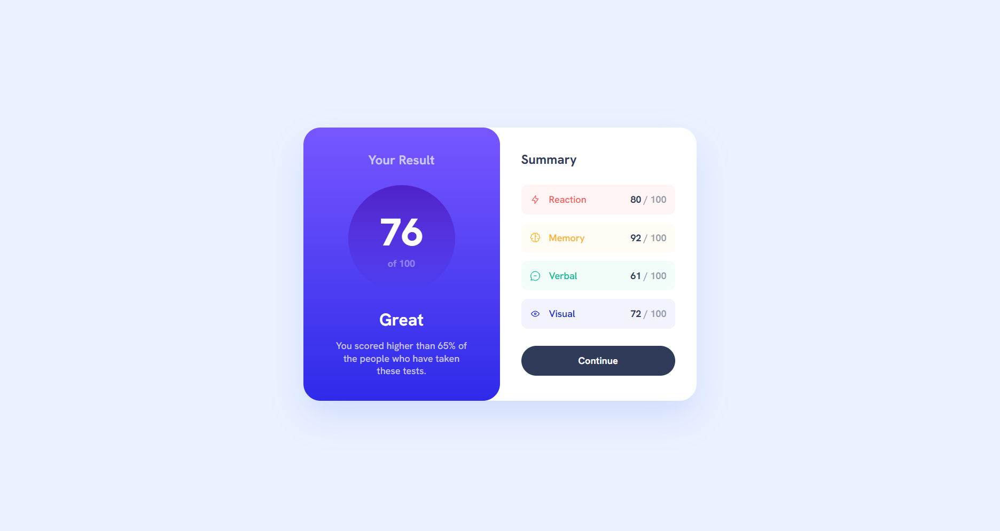

# Frontend Mentor - Results summary component solution

This is a solution to the [Results summary component challenge on Frontend Mentor](https://www.frontendmentor.io/challenges/results-summary-component-CE_K6s0maV). Frontend Mentor challenges help you improve your coding skills by building realistic projects.

## Table of contents

- [Overview](#overview)
  - [The challenge](#the-challenge)
  - [Screenshots](#screenshots)
  - [Links](#links)
- [My process](#my-process)
  - [Built with](#built-with)
  - [Implementation Journey](#implementation-journey)
  - [What I learned & Key Challenges](#what-i-learned--key-challenges)
- [Project Estimation & Retrospective](#project-estimation--retrospective)
- [Author](#author)

## Overview

### The challenge

Users should be able to:

- View the optimal layout depending on their device's screen size (Desktop 1100px, Tablet 768px, and Mobile 375px).
- See interactive hover and focus states for all interactive elements (such as the Continue button) to ensure native accessibility.
- Experience a fully fluid responsive layout transition that shifts gracefully from a full-width single-column mobile viewport into an asymmetric two-column desktop card grid.

### Screenshots
  
*Fig 1. Final look of my responsive NFT preview card component using production-ready SCSS compilation and accessibility-focused focus-visible states.*

### Links

- Solution URL: [Solution Link](https://github.com/Osty-trainee/Results-summary-component)
- Live Site URL: [Live Site Link](https://osty-trainee.github.io/Results-summary-component/)

## My process

### Built with

- Semantic HTML5 markup (`<main>` container layout root, distinct `<article>` card wrapper, and structural `<section>` content panels).
- BEM (Block-Element-Modifier) methodology ensuring modular nesting, isolated styling environments, and clean encapsulation inside compiled rules.
- **Flexbox Layout System** utilized both as a macro tool for responsive column shifting and on a micro level within list items for exact linear distribution and alignment.
- Native CSS Custom Properties (`:root`) acting as a single source of truth for color design tokens, custom typography rules, and an 8px-based spacing system (`--spacing-100`, `--spacing-200`, etc.).
- Modular Sass/SCSS architecture dividing code blocks into dedicated system files (`_fonts.scss`, `_variables.scss`, `_reset.scss`, `_card.scss`, and the main `main.scss` entry point).
- Strict Git project state management tracking source `scss/` transformations while ignoring local workspace clutter via an optimized `.gitignore` runtime blueprint.

### Implementation Journey

This project was built following a strict, atomic, and systematic step-by-step development process using Git for version control:
1. **Repository Setup**: Initialized the project with a robust `.gitignore` file to separate code from compiled styles and local setup logs.
2. **Semantic Structure**: Built the pure HTML skeleton from scratch utilizing semantic tags and structured it entirely according to the BEM methodology for ultimate reusability.
3. **Asset Organization**: Uploaded and linked native variable fonts and vector illustrations (`.svg`).
4. **SCSS Architecture & Tokens**: Set up a clean, modular folder structure using SCSS partials and defined global CSS variables in the `:root`.
5. **Responsive Implementation**: Developed layout in stages, starting with a bulletproof **Mobile-first** layout, then creating intermediate tablet constraints, and finally scaling into a two-column desktop grid.

### What I learned & Key Challenges

This project presented highly unique rendering obstacles across variable screen widths, requiring rigorous design system calibrations and precise structural debugging:

1. **The Inherited Opacity Isolation Bug:** 
   During development, attempting to apply a soft opacity to the secondary score tracking element (`/ 100`) caused an unintended layout cascade where the current dynamic score number (`-num`) also faded out. I discovered that applying a global `opacity` to the parent text block forces all nested child elements to inherit the transparency layer. To restore perfect visual contrast, I refactored the base coloring mapping to target the main layout line with high-precision alpha-channel colors while isolating the node color independently:
   ```scss
   /* Isolating inheritance by avoiding global opacity on the parent container */
   &__score {
       color: hsl(224, 30%, 27%, 0.5); /* Applies transparency purely to the "/ 100" text string */
       font-size: var(--spacing-200);
       font-weight: 700;

       &-num {
           color: var(--navy-950); /* Restores full crisp saturation to the core dynamic score */
       }
   }
   ```

2. **The Background Color vs. Color Property Mismatch:** 
   An unintended rendering bug occurred where heavy, dark rectangular boxes appeared wrapped tightly around the text score elements. The issue was traced to a subtle syntax mismatch inside the nested selector string where `background-color: var(--navy-950)` was accidentally declared instead of the native font `color` property. Correcting the property target safely removed the fallback background plates and instantly restored the clean typography layout line:
   ```scss
   /* Correcting the selector property to prevent background box leaks */
   &-num {
       color: var(--navy-950); /* Correct native font coloring injection */
       /* Removed background-color block to allow clean transparency flow */
   }
   ```

3. **Dynamic Feedback Gradient & Keyboard Accessibility:** 
   To match the exact design specifications of the score circle, I configured a vertical linear gradient that transitions smoothly into alpha-channel transparency at the bottom boundary. Additionally, to enhance standard keyboard navigation support without breaking the visual aesthetic for mouse clicks, I implemented advanced `:focus-visible` parameters on the primary button:
   ```scss
   &__score-circle {
       background: linear-gradient(to bottom, var(--gradient1-1), var(--gradient1-2)); /* Smooth fading gradient */
   }

   &__btn {
       /* Standard interactive layout rules */
       transition: background-color 0.2s ease, outline 0.1s ease;

       &:focus-visible {
           outline: 3px solid var(--gradient2-1); /* Clean, high-contrast focus state for Tab navigation */
           outline-offset: 3px;
       }
   }
   ```

## Project Estimation & Retrospective

- **Initial Estimation:** 2 to 3 hours.
- **Actual Time Taken:** ~ 3.5 hours (including design system spacing configuration, multi-stage breakpoint compilation, local font compilation auditing, and clean `.gitignore` cache pruning).

**Retrospective Summary:** While component blocks may appear simple on the surface, balancing complex color configurations, asymmetric corner boundaries (`border-radius: 2rem 0 0 2rem` on desktop), and strict contrast requirements requires a clean, systemic CSS strategy. Using a structured Mobile-first approach alongside atomic SCSS compilation successfully prevents overlapping states and allows components to scale fluidly without resorting to fragile hardcoded pixel overrides.

## Author

- GitHub - [@Osty-trainee](https://github.com/Osty-trainee)
- Frontend Mentor - [@Osty-trainee](https://www.frontendmentor.io/profile/Osty-trainee)
